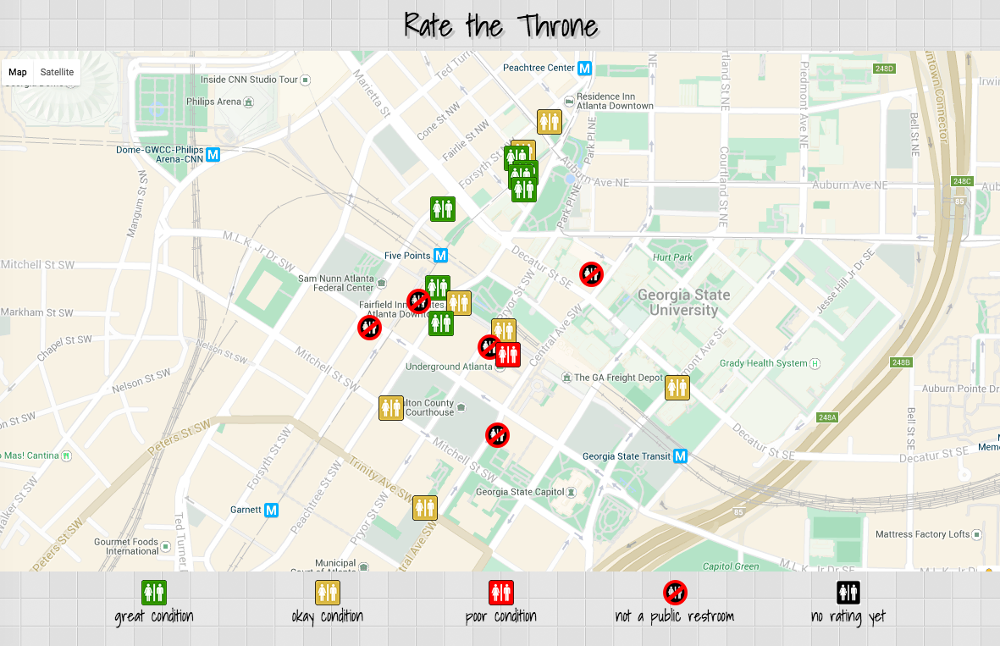
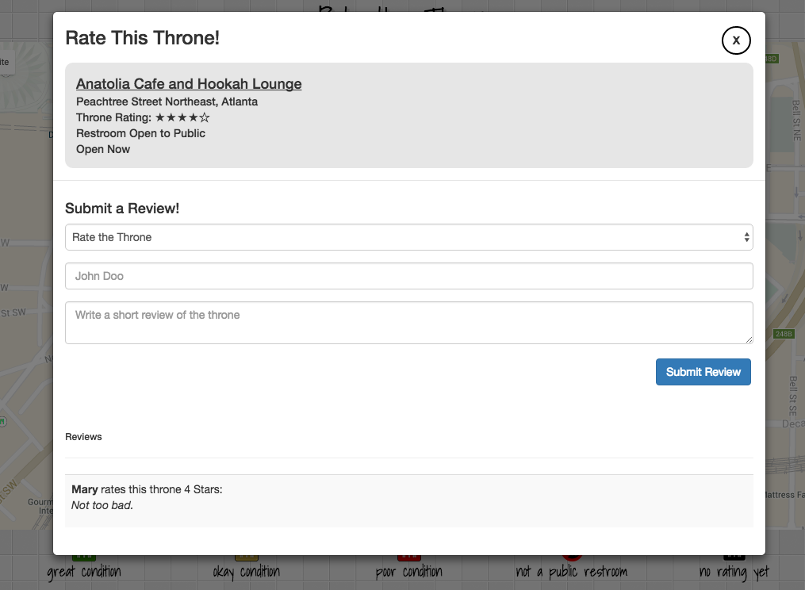
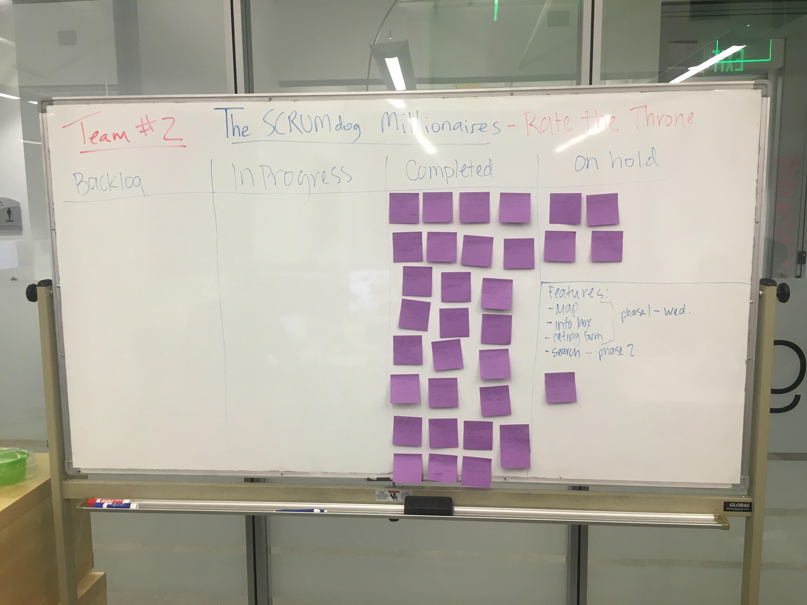

#Rate the Throne
##The Go-To App When You Gotta Go

##Overview of Project
Rate the Throne is a crowdsourced public restroom rating app. Users can use Rate the Throne to view and contribute ratings of public restrooms in their surrounding area.

##Technologies, Frameworks, and Programming Languages used
* HTML5 & CSS3
* Google Maps API
* JavaScript
* AngularJS
* Bootstrap 3
* AngularUI - Bootstrap Modals
* Animate CSS

##Contributors
We worked on Rate the Throne mostly using mob programming.
* [Tim Sanders](https://github.com/tsanders30004) - SCRUM Master
* [Cody Barber](https://github.com/codybarber)
* [Carolyn Daniel](https://github.com/csdaniel17)
* [DeeAnn Kendrick](https://github.com/dkendrick25)

##Project Screenshots

Rate the Throne Homepage

Rate the Throne Review Modal

SCRUM Board

##3 contributions your team would like for others to add to the project
1. Add a back end to store review data
2. Add in Yelp API to auto-populate the map to include locations (and any current restroom reviews)
3. Fix styling to function better on mobile

##URL to live project

[Check it out!](http://ratethethrone.surge.sh/)
